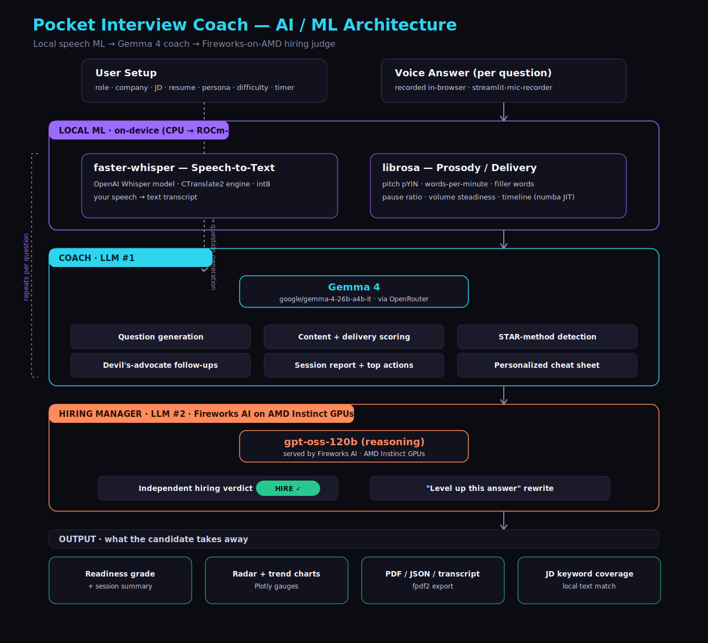
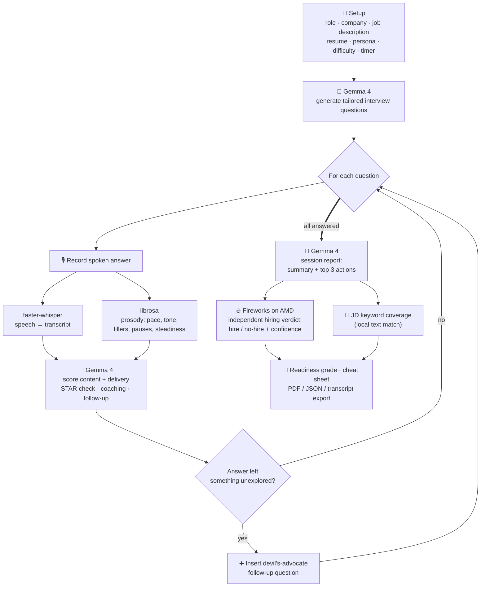

# Pocket Interview Coach (Streamlit Edition)

A single-process Streamlit rebuild of Pocket Interview Coach — live mock-interview practice with AI
coaching on **content** (what you said) and **delivery** (how you said it).

**Two independent AIs, two roles:** **Gemma 4** is your *coach* (question generation, per-answer
scoring, follow-ups, cheat sheets), and a separate **Fireworks-hosted model running on AMD Instinct
GPUs** plays the *hiring manager* — reviewing the whole interview and making a real hire / no-hire
call, plus rewriting your own answers into stronger versions. Using two different providers/models
means the final verdict is a genuine second opinion, not the coach grading itself.

This is a from-scratch Streamlit port of the original FastAPI + Next.js version, built for simpler,
more reliable free hosting (Streamlit Community Cloud). The core AI pipeline (question generation,
speech-to-text, delivery-metric analysis, scoring, follow-ups, cheat sheets) is identical — only the
UI framework and hosting model changed.

## Links

- **Live app (this Streamlit version):** https://pocket-interview.streamlit.app

### The original FastAPI + Next.js version

The first version was a two-service app — a FastAPI backend on **Render** and a Next.js frontend on
**Vercel**. It's more feature-complete (live in-recording coaching, animations, PWA install), but
Render's free tier proved **slow and memory-constrained** (50+ second cold starts and out-of-memory
restarts under the whisper + librosa workload), which is exactly why this simpler, faster Streamlit
edition was built. Links to that original version:

- **Code (FastAPI + Next.js):** https://github.com/sanjai-b-2006/pocket_interview_new
- **Frontend (Vercel):** https://pocket-interview-new.vercel.app
- **Backend API (Render — note: slow to cold-start on the free tier):** https://pocket-interview-new.onrender.com

## Features

- Role, company, job description, resume upload, experience level, and number-of-questions setup
- **Session types**: job interview, salary negotiation, performance review, difficult feedback
- **Interviewer personas** (friendly recruiter, tough tech lead, skeptical panel, rapid-fire founder)
  and **panel mode** (rotates personas per question)
- Guaranteed basic warm-up question every session, drawn from a 27-question pool
- Resume-aware project questions, questions ordered easy → hard, domain-specific framing
- **Weakness drills**: after a report, jump into a focused mini-session on your weakest area
- Live mic recording (via `streamlit-mic-recorder`), text-to-speech question playback
- Content **and** delivery scoring (0-100) with plain-English feedback for both
- AI-generated **devil's-advocate follow-up questions** inserted mid-session when an answer leaves
  something unexplored
- Per-answer delivery timeline chart (pace/tone over time), end-of-session score trend chart
- Personalized post-session **cheat sheet**
- **Bring-your-own-key** — override the app's default API key/base URL/model right in the sidebar
- **STAR-method breakdown** — a situation/task/action/result checklist per behavioral answer
- **Multi-axis performance radar** (content, delivery, pace, tone, low-fillers) per answer and
  averaged across the whole session
- **Own-answer playback** — listen back to exactly what you recorded, next to the AI feedback
- **Interview readiness score + letter grade**, with a celebratory `st.balloons()` on a strong result
- **Export your report** as PDF, plain-text transcript, or JSON, one click each
- **"Surprise me"** role randomizer and an optional visual countdown timer during recording
- **🔥 Independent hiring verdict** — a Fireworks model on AMD gives a Strong Hire → No-Hire call
  with confidence, rationale, the case for/against you, and your standout moment
- **⚡ Level up this answer** — a Fireworks model rewrites your *own* answer into a stronger version
  (grounded in what you actually said — no invented achievements)
- **🎯 Job-description keyword coverage** — which key terms from the JD you actually worked into
  your spoken answers, and which you missed

## How it works — full workflow

The core idea is a **hybrid pipeline**: cheap, private voice analysis runs locally, and the heavy
reasoning is split across two independent models — **Gemma 4 as the coach** and a **Fireworks-hosted
model on AMD Instinct GPUs as the hiring manager**.





### Step by step

1. **Setup** — you enter a target role and optionally a company, job description, resume,
   interviewer persona, panel mode, difficulty, session type, and a pressure timer.
2. **Question generation** — Gemma 4 writes a tailored set of questions (a guaranteed warm-up first,
   then role-specific behavioral + technical questions ordered easy → hard), with a model answer for
   each.
3. **Record** — for each question, you record a spoken answer in the browser (`streamlit-mic-recorder`).
4. **Transcribe (local)** — `faster-whisper` converts your speech to text on CPU.
5. **Delivery metrics (local)** — `librosa` extracts words-per-minute, pitch variation (monotone vs
   expressive), filler-word count, pause ratio, and volume steadiness, plus a per-answer timeline.
6. **Coach (Gemma 4)** — transcript + metrics go to Gemma 4, which returns a content score, a
   delivery score, plain-English feedback on both, a STAR-method checklist, and — if the answer left
   something open — a devil's-advocate **follow-up question** that gets inserted into the session.
7. **Repeat** until every question (including any dynamic follow-ups) is answered. You can **re-record**
   any answer.
8. **Report (Gemma 4)** — an end-of-session summary, an overall readiness grade, score trends, and a
   personalized cheat sheet.
9. **Hiring verdict (Fireworks on AMD)** — an *independent* model reviews the whole interview and
   commits to a real hire / no-hire call with confidence, the case for/against you, and your standout
   moment. The same model powers **"level up this answer."**
10. **Take it away** — job-description keyword coverage, plus one-click **PDF / JSON / transcript**
    exports.

## What's different from the FastAPI + Next.js version

Streamlit's rerun-based execution model doesn't support a few things the original had, so this
version intentionally does not include:
- Live in-recording pace/filler coaching (needs continuous client-side JS during recording)
- The animated waveform visualizer and Framer Motion transitions
- PWA installability (manifest/icons/"add to home screen")
- Cross-session history/gamification (Streamlit sessions don't persist a per-user identity the way
  browser localStorage did)

Everything else — the actual AI/scoring pipeline — is the same code, ported directly.

## Running locally

```bash
python -m venv venv
source venv/Scripts/activate   # or venv/bin/activate on macOS/Linux
pip install -r requirements.txt

cp .env.example .env
# edit .env: set FIREWORKS_API_KEY (OpenRouter or Fireworks)

streamlit run app.py
```

Open http://localhost:8501.

## Running with Docker

```bash
docker build -t pocket-interview-streamlit .
docker run -p 8501:8501 --env-file .env pocket-interview-streamlit
```

## Deploying to Streamlit Community Cloud (free)

1. Push this repo to GitHub (public).
2. Go to **share.streamlit.io** → **New app** → select this repo, branch `main`, main file `app.py`.
3. Under **Advanced settings → Secrets**, add:
   ```toml
   # Coach (Gemma 4)
   FIREWORKS_API_KEY = "your_openrouter_key"
   FIREWORKS_BASE_URL = "https://openrouter.ai/api/v1"
   GEMMA_MODEL = "google/gemma-4-26b-a4b-it"

   # Independent hiring manager (Fireworks on AMD) — enables the verdict + answer rewrite
   JUDGE_API_KEY = "your_fireworks_key"
   JUDGE_BASE_URL = "https://api.fireworks.ai/inference/v1"
   JUDGE_MODEL = "accounts/fireworks/models/gpt-oss-120b"
   ```
4. Deploy. Streamlit Cloud installs `requirements.txt` (Python packages) and `packages.txt` (system
   packages -- just `ffmpeg`, needed by `faster-whisper`/`librosa`) automatically. No Dockerfile
   needed for this path (the Dockerfile is provided to satisfy the hackathon's containerization
   requirement and for self-hosting elsewhere). First deploy takes a few minutes since it's building
   the whole ML dependency stack from scratch.

## Environment variables

| Variable | Purpose |
|---|---|
| `FIREWORKS_API_KEY` | Coach (Gemma 4) API key — OpenRouter or Fireworks |
| `FIREWORKS_BASE_URL` | `https://openrouter.ai/api/v1` or `https://api.fireworks.ai/inference/v1` |
| `GEMMA_MODEL` | Exact model slug for your provider |
| `JUDGE_API_KEY` | Fireworks key for the independent hiring verdict + answer rewrite (blank = feature disabled) |
| `JUDGE_BASE_URL` | `https://api.fireworks.ai/inference/v1` (default) |
| `JUDGE_MODEL` | `accounts/fireworks/models/gpt-oss-120b` (default) |
| `ASR_DEVICE` | `cpu` (default) |
| `ASR_MODEL_SIZE` | `base` (default) — use `tiny` on memory-constrained hosts |
| `ENABLE_PITCH_ANALYSIS` | `true` (default) — set `false` to skip the memory-heavier pitch-tracking pass on constrained hosts |

## Project structure

```
app.py                   Single-file Streamlit UI (setup / session / report screens)
services/
  config.py               Env-var settings
  llm.py                  Gemma 4 coach: question generation, personas, session types, feedback, cheat sheets
  fireworks.py            Independent Fireworks (AMD) hiring manager: hire/no-hire verdict + answer rewrite
  asr.py                  faster-whisper speech-to-text
  prosody.py              librosa-based delivery metrics (pace, tone, pauses, filler words, timeline)
  resume.py                PDF/text resume extraction
  models.py                In-memory session/question/answer dataclasses (no database needed)
  interview.py             Orchestrates the above into create_session / process_answer / build_report / build_cheat_sheet
```

No database is used — each browser session holds its own `InterviewSession` in Streamlit's
`st.session_state`, which is all that's needed since there's no cross-session history feature.
